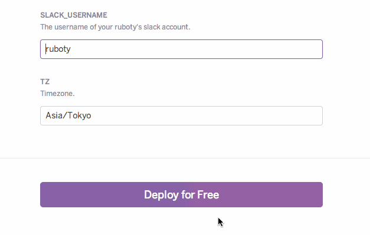
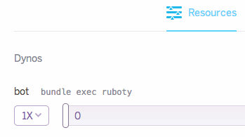

# ruboty-archlinuxjp

- [ruboty-talk](https://github.com/r7kamura/ruboty-talk)

```bash
$ heroku config:add DOCOMO_API_KEY="xxx"
$ heroku config:add DOCOMO_CHARACTER_ID="1"
```

```bash
> @rrbot テスト
> テストですか?
```

- [ruboty-syoboi_calendar](https://github.com/r7kamura/ruboty-syoboi_calendar) 

```bash
> @rrbot list anime
```

- [ruboty-qiita_scouter](https://github.com/tbpgr/ruboty-qiita_scouter)

```bash
> @rrbot qiita scouter tbpgr
ユーザー名: tbpgr 戦闘力: 218544 攻撃力: 27840 知力: 183860 すばやさ: 6844
```

# ruboty-template
A template to create and deploy your [ruboty](https://github.com/r7kamura/ruboty) on slack.

* Your team owner need to enable [XMPP Gateway](https://my.slack.com/admin/settings).
* It's recommended to create a new slack account for your ruboty.

## 1. Deploy
Press "Deploy to Heroku" button and fill in a form to deploy Ruboty to heroku.

[](https://heroku.com/deploy)



## 2. Add dyno
Because Heroku doesn't create dyno by default,
you need to add 1 dyno from [dashboard](https://dashboard-next.heroku.com/apps).



## 3. Fork
Fork this repository if you want to add other plug-ins. :fork_and_knife:  
See https://github.com/r7kamura/ruboty for more details about ruboty and its plug-ins.
